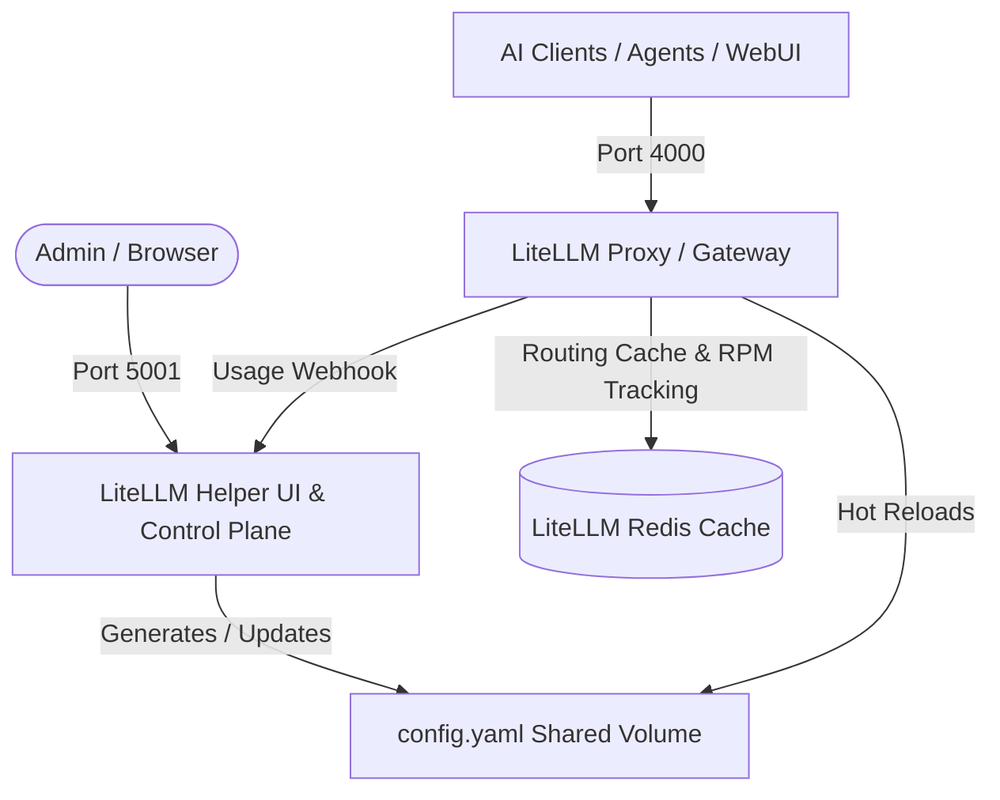

> ### 🌐 [Homelab Sovereign Cluster Architecture](https://github.com/medzarka/homelab-nodes)
> This repository is a modular component of the **Homelab Sovereign Multi-Node Cluster** — an enterprise-grade, privacy-first, self-hosted infrastructure spanning cloud VPS, on-premise compute servers, and edge ARM nodes.
> 
> * **Zero-Trust Network**: Multi-host WireGuard mesh interconnect via **Tailscale** with strict **Firewalld** zoning (`iptables: false`).
> * **Unified Identity & Ingress**: Centralized reverse proxy via **Traefik v3**, **Authelia SSO (2FA)**, and **LLDAP Directory**.
> * **Cluster Orchestration & GitOps**: High-availability **Docker Swarm** managed declaratively via **Arcane Cockpit**.
> * **End-to-End Observability**: Centralized portal (**Homepage**), metrics (**Beszel**), real-time logs (**Dozzle**), and uptime monitoring (**Uptime Kuma**).
> * **Sovereign Local AI & Compute**: Distributed inference (**LiteLLM**, **Ollama**, **Qdrant**, **Mem0**, **Hermes Agents**).
> * **Private Cloud & Storage**: Encrypted data synchronization, automated backups, and multi-cloud mirrors.

---

# ⚡ LiteLLM Helper & Gateway Control Plane

A self-hosted management UI, analytics dashboard, and automated configuration generator for the **LiteLLM AI Gateway / Proxy**.

Optimized for **ARM64 and AMD64** Linux/Docker environments.

---

## 🏛️ Architecture Overview



---

## 🎯 Features

- **Dynamic YAML Generation:** Manage upstream LLM providers, API keys, fallback routes, and load balancing rules via web UI.
- **Hot Reloading:** LiteLLM dynamically watches `config.yaml` and reloads models with zero downtime.
- **Usage & Rate Tracking:** Captures token counts, request latency, and cost analytics via Redis and SQLite.
- **Automatic Key Rotation & Fallbacks:** Seamlessly route requests to backup models when providers experience rate limits.
- **Email Alerts:** Send notifications via SMTP when usage quotas are reached.

---

## 🚀 Quick Start

### 1. Configure Environment
```bash
cp .env.example .env
nano .env
```
Generate strong keys:
```bash
openssl rand -hex 16
```

### 2. Deploy the Stack
```bash
docker compose up -d
```
The `init-volumes` container will automatically create `/data` storage directories and initialize an empty `config.yaml` if not already present.

### 3. Access the Services
- **LiteLLM Helper UI (via Traefik Sub-path):** `https://<tailscale-or-domain>/litellm-helper`
- **LiteLLM Proxy Endpoint (via Traefik Sub-path):** `https://<tailscale-or-domain>/litellm/v1`
- **Via Dedicated Domains (if configured):**
  - Helper: `https://<LITELLM_HELPER_DOMAIN>` (e.g. `https://helper.homelab-gw.ts.net`)
  - LiteLLM: `https://<LITELLM_DOMAIN>` (e.g. `https://litellm.homelab-gw.ts.net`)
- **Via Direct Local Ports:**
  - LiteLLM Helper: `http://<server-ip>:5001`
  - LiteLLM Proxy API: `http://<server-ip>:4000/v1`

---

## ⚙️ Hardware Tuning & Performance

- **Worker Concurrency:** `LITELLM_WORKERS=4` allocates parallel worker processes across multi-core CPUs.
- **Ulimits:** Configured `nofile: 65536` for high concurrent network socket throughput.
- **Log Rotation:** Docker JSON logging is limited to `10m` / max 3 files.

---

## 🔒 Security Best Practices

- Change `LITELLM_HELPER_PASSWORD`, `FLASK_SECRET_KEY`, and `LITELLM_MASTER_KEY` before deployment.
- `.env` and `data/` are strictly ignored by Git to protect API keys and usage history databases.
- The `shared_net` Docker network attaches to your reverse proxy with `external: true`.
